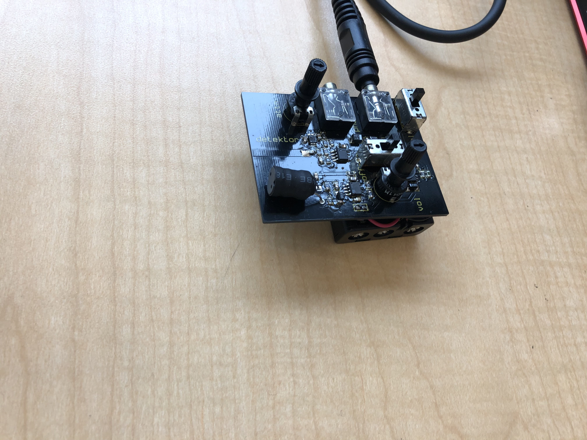

# NETWORK SONIFICATION AND THE ALGORHYTHMICS OF EVERYDAY LIFE

## The sounds of seamless networks from the lab to the livingroom



<!--Syntax highlighted code block

# Header 1
## Header 2
### Header 3

`code?```

- Bulleted
- List

1. Numbered
2. List

**Bold** and _Italic_ and `Code` text

[Link](url) and -->
